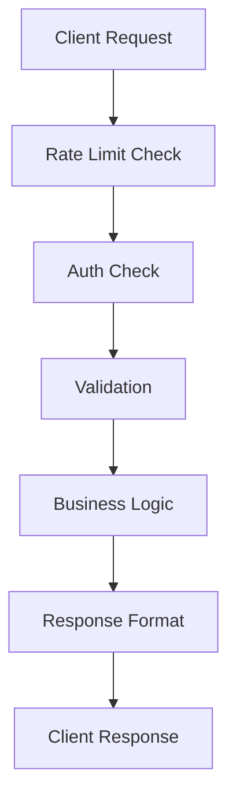

# Architecture Overview

This document describes the core architecture of the Flask API Boilerplate, explaining how different components work together to provide a robust, scalable API framework with AI capabilities.

## Core Concepts

### Model-First Design

We follow a model-first approach using SQLModel, which combines SQLAlchemy's ORM capabilities with Pydantic's validation:

```python
from sqlmodel import SQLModel, Field
from datetime import datetime

class CoreModel(SQLModel):
    """Base model for all database models"""
    id: int = Field(default=None, primary_key=True)
    created_at: datetime = Field(default_factory=datetime.utcnow)
    updated_at: datetime = Field(default_factory=datetime.utcnow)

class User(CoreModel, table=True):
    """Example of a model implementation"""
    email: str = Field(unique=True, index=True)
    hashed_password: str
    is_active: bool = Field(default=True)
```

## Core Components

### Database Structure

We use PostgreSQL with SQLModel for:
- Type-safe database operations
- Automatic schema validation
- Migration management (Alembic)
- Relationship handling

Key concepts:
```python
# Models are defined in app/models/
# Database setup in app/core/db.py
# Migrations in migrations/
```

### Caching

Redis-based caching system with:
- Response caching
- Rate limiting
- Session storage
- Background task queues

Configuration:
```python
# app/core/cache.py
class CacheManager:
    def __init__(self):
        self.redis = Redis.from_url(settings.REDIS_URL)
        self.default_ttl = 3600  # 1 hour

    async def get_or_set(self, key: str, func, ttl: int = None):
        """Get from cache or compute and store"""
        if value := await self.get(key):
            return value
        value = await func()
        await self.set(key, value, ttl)
        return value
```

### Rate Limiting

Configurable rate limiting using Redis:
- Global and per-endpoint limits
- Burst handling
- Custom rate limit rules

Example configuration:
```python
# app/core/config.py
RATE_LIMIT_ENABLED = True
RATE_LIMIT_DEFAULT = 60  # requests per minute
RATE_LIMIT_WINDOW = 3600  # time window in seconds
```

### Authentication & Authorization

JWT-based authentication system:
- Token-based authentication
- Role-based access control
- Session management
- Token refresh mechanism

Implementation:
```python
# app/core/auth.py
@require_auth
@require_roles(['admin'])
def protected_route():
    """Only accessible by admins"""
    pass
```

## AI Service Integration

Modular AI service integration supporting multiple providers:
- Provider-agnostic interface
- Response validation
- Error handling
- Request/response logging

```python
# app/core/ai/base.py
class AIProvider(Protocol):
    """Base protocol for AI providers"""
    async def generate(self, prompt: str, **kwargs) -> str:
        """Generate text using AI model"""
        ...

# app/core/ai/providers/openai.py
class OpenAIProvider(AIProvider):
    """OpenAI implementation"""
    def __init__(self):
        self.client = OpenAI(api_key=settings.AI_API_KEY)
```

## Security Model

### Request Validation

All requests are validated using Pydantic models:
```python
# app/models/requests/user.py
class UserCreateRequest(BaseModel):
    email: EmailStr
    password: str = Field(min_length=8)
    full_name: str
```

### Response Format

Standardized response format:
```python
# app/core/responses.py
class APIResponse(BaseModel):
    success: bool
    message: Optional[str] = None
    data: Optional[Dict] = None
    warnings: List[str] = []
```

### Error Handling

Centralized error handling:
```python
# app/core/exceptions.py
class APIError(Exception):
    def __init__(self, message: str, code: str = None, status: int = 400):
        self.message = message
        self.code = code
        self.status = status
```

## Directory Structure

```
app/
├── api/                 # API endpoints
│   └── v1/             # API version 1
├── core/               # Core functionality
│   ├── ai/            # AI integration
│   ├── auth/          # Authentication
│   └── cache/         # Caching
├── models/            # Database models
├── schemas/           # Pydantic schemas
└── services/          # Business logic
```

## Request Flow

1. Request received by Flask
2. Rate limiting check
3. Authentication/Authorization
4. Request validation
5. Business logic execution
6. Response formatting
7. Response sent to client



## Scaling Considerations

The architecture supports horizontal scaling through:
- Stateless application design
- Redis for shared state
- Database connection pooling
- Docker containerization

## Next Steps

- [API Documentation](../api/README.md)
- [Development Guide](../development/README.md)
- [Deployment Guide](../deployment/README.md)

## Related Resources

- [SQLModel Documentation](https://sqlmodel.tiangolo.com/)
- [Flask Documentation](https://flask.palletsprojects.com/)
- [Redis Documentation](https://redis.io/docs/)